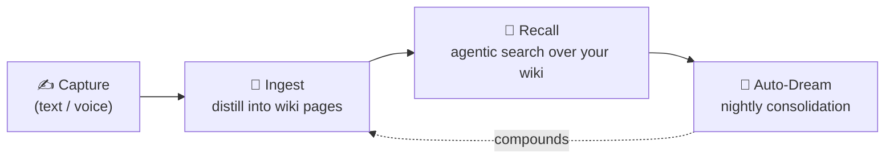

<div align="center">

# 🧠 QCue

**A capture-first “second brain” that turns fleeting thoughts into a living, linked knowledge wiki — powered by _your own_ LLM keys.**

[](https://github.com/SparkyWen/qcue/actions/workflows/ci.yml)
[](LICENSE)
[](qcue-rs)
[](qcue_app)
[](#-architecture)
[](#-architecture)
[](#-what-is-qcue)
[](CONTRIBUTING.md)

**English** · [简体中文](README.zh-CN.md)

</div>

> [!NOTE]
> **BYOK — bring your own key.** QCue runs entirely against _your own_ model-provider key.
> It never ships, brokers, or sees your credentials, and the whole product runs **keyless and
> offline** in stub mode so you can explore it in seconds.

QCue is an open-source knowledge, memory, and semantic-recall system. Dump fleeting ideas — typed or
spoken — into a fast daily feed; a bring-your-own-key LLM continuously distills that stream into a
persistent, interlinked **Markdown wiki** (`[[wikilinks]]`, an `index.md`, a `log.md`) that you can
browse, query by **recall**, and open in any Markdown editor. A nightly **Auto-Dream** pass keeps the
knowledge base coherent.

---

## 📑 Table of contents

- [✨ What is QCue](#-what-is-qcue)
- [🔄 The daily loop](#-the-daily-loop)
- [🧱 The three layers](#-the-three-layers)
- [🏗️ Architecture](#-architecture)
- [🧰 Tech stack](#-tech-stack)
- [📂 Repository layout](#-repository-layout)
- [🚀 Quickstart](#-quickstart)
- [📚 Documentation](#-documentation)
- [🗺️ Roadmap](#-roadmap)
- [🔐 A note on this repository’s history](#-a-note-on-this-repositorys-history)
- [🤝 Contributing](#-contributing)
- [💬 Community](#-community)
- [🛡️ Security](#-security)
- [📄 License](#-license)
- [™️ Trademark](#-trademark)

---

<a id="-what-is-qcue"></a>

## ✨ What is QCue

|  |  |
| --- | --- |
| 🎙️ **Capture-first** | Type or speak. Ideas land in an append-only daily feed with zero friction — the cost of capturing a thought should be near zero. |
| 🔗 **LLM-wiki** | A BYOK model distills your feed into a Karpathy-style Markdown wiki of entity / concept / source pages, woven together with `[[wikilinks]]`. |
| 🔎 **Agentic recall** | Ask in natural language. The model generates its _own_ search patterns over full-text search + curated memory and answers from your wiki. |
| 🌙 **Auto-Dream** | A nightly consolidation pass compounds and tidies the wiki — cost-checked _before_ any provider call, with edits proposed through a reversible approve gate. |
| 🔌 **BYOK & provider-agnostic** | One harness, many providers. A session can start on one model and fall back to another without re-encoding. You own the keys. |
| 📴 **Offline-first** | The Flutter app captures locally first and flushes idempotently, so it works on a plane. A keyless **stub mode** runs the entire product with no network. |
| 🔒 **Multi-tenant by design** | Isolation enforced by database **row-level security**, not application-level filtering. |
| 🦀 **Built to last** | A Rust core with a strict, lint-enforced crate-layering law; the whole stack is testable keyless and networkless. |

---

<a id="-the-daily-loop"></a>

## 🔄 The daily loop



```
capture (text / voice)
   └─► conversation-ingest distills it into wiki pages (entities, concepts, sources)
          └─► recall: you ask, the model generates its own search patterns and answers
                 └─► nightly Auto-Dream consolidates & compounds the wiki
```

---

<a id="-the-three-layers"></a>

## 🧱 The three layers

QCue keeps a clean separation between what _you_ wrote, what the _LLM_ maintains, and the rules that
govern structure:

| Layer | Owner | What it is |
| --- | --- | --- |
| 📥 **Raw sources** | **You** | Your append-only capture feed — the ground truth, never rewritten. |
| 📖 **The wiki** | **The LLM** | LLM-maintained Markdown (Obsidian-compatible) distilled from your sources. |
| ⚙️ **The schema** | **You (approved)** | A per-tenant configuration that governs structure — human-approved. |

---

<a id="-architecture"></a>

## 🏗️ Architecture

QCue is three real code areas, layered into a strict acyclic stack.

- **🦀 The harness (`qcue-rs/`).** The load-bearing seam between QCue and any LLM provider. A single
  turn loop drives a conversation and **never branches on provider name** — it reaches a provider only
  through a small dispatch trait (a scripted stub for tests, or live HTTP). **Adding a provider is
  data, not new branches:** a vendor is a declarative profile plus a few stateless hooks and
  wire-quirk entries. Everything normalizes into one internal message shape and one stream-event
  shape, so a session can fall back between providers without re-encoding. Credentials live in a pool
  with explicit health states; errors are classified once, then a retry loop maps the classification
  to exactly one of _rotate / fall back / back off / abort_.

- **💡 The idea engine (`qcue-rs/`).** **Dual representation:** the Markdown body in a per-tenant vault
  is the source of truth; a database mirrors structure and frontmatter for fast queries and linting. A
  single **write gate** is the only place wiki bodies are written — it sanitizes links, updates the
  mirror, then writes the file. **Recall is agentic.** **Auto-Dream** runs as a background pass with
  cost checked _before_ any provider call.

- **🌐 The backend (`qcue-rs/`).** A multi-tenant Axum server: **row-level security** on every table
  (each request binds a tenant context), authentication, an encrypted BYOK vault, a job queue,
  server-sent-event and websocket channels for live turns and recall, and a CRDT sync hub. Background
  workers and the consolidation cron are feature-gated and disabled by default.

- **📱 The app (`qcue_app/`).** Offline-first Flutter (Android + iOS). **One data seam:** a single
  API-client interface has a stub implementation (fixtures, keyless) and an HTTP implementation; an
  offline-aware decorator captures writes locally first and flushes idempotently, so screens are
  unaware of connectivity. Design tokens are centralized and enforced by an architecture test.

> **Crate layering law** (enforced in CI):
> `protocol → http → llm-api → providers → router → {wiki, ideas} → {backend, ffi}`.
> `protocol/` is serialization-only — anything crossing the Rust↔Dart boundary belongs there, and a
> codegen step exports a shared schema + Dart models with a drift test that fails CI if they go stale.

📎 More detail: [`docs/architecture.md`](docs/architecture.md) · [`docs/design-decisions.md`](docs/design-decisions.md)

---

<a id="-tech-stack"></a>

## 🧰 Tech stack

| Area | Technologies |
| --- | --- |
| 🦀 **Core & backend** | Rust (edition 2024) · Axum · Tokio · SQLx · PostgreSQL 16 · Redis 7 |
| 📱 **App** | Flutter · Dart · Riverpod · Kotlin (Android) · Swift (iOS) |
| 🧠 **LLM** | Provider-agnostic harness · BYOK · full-text search (`tsvector` + `pg_trgm`, CJK-aware) |
| 🎨 **Design** | Centralized design tokens · multi-theme · architecture-tested |
| 🧪 **Quality** | TDD throughout · keyless/networkless stub · CI layering & purity lints |

---

<a id="-repository-layout"></a>

## 📂 Repository layout

```
qcue/
├── qcue-rs/             # 🦀 Rust workspace — harness core + idea engine + multi-tenant backend
│   ├── protocol/        #    serde-only shared types (the Rust↔Dart boundary)
│   ├── http/ llm-api/   #    provider-neutral transport + typed wire + stream parsers
│   ├── providers/       #    declarative provider profiles + hooks + wire-quirk tables
│   ├── router/          #    THE HARNESS: turn loop, credential pool, retry/rotate/fallback, stub
│   ├── wiki/ ideas/     #    THE IDEA ENGINE: write-gate wiki, agentic recall, Auto-Dream
│   ├── app-server/      #    THE BACKEND: auth + BYOK vault + job queue + SSE/WSS + sync hub
│   └── migrations/      #    SQLx migrations (tenancy/RLS … sync)
│
├── qcue_app/            # 📱 Flutter app (Android + iOS)
│   └── lib/
│       ├── core/        #    API seam, offline cache, themes & design tokens, models
│       └── features/    #    the screens: capture · wiki · recall · activity · settings
│
├── design-system/      # 🎨 shared visual language & design tokens
└── docs/               # 📚 curated public documentation
```

---

<a id="-quickstart"></a>

## 🚀 Quickstart

> [!TIP]
> The fastest way to explore QCue is **stub mode** — it runs the entire product with **no API key and
> no network** via seeded fixtures.

### 📱 App (Flutter)

```sh
cd qcue_app
flutter pub get
flutter test                                      # unit + widget + architecture tests
flutter analyze
flutter run --dart-define=QCUE_STUB=true          # offline/demo, seeded fixtures, keyless
```

### 🦀 Backend (Rust)

```sh
cd qcue-rs
cargo test --lib                                  # fast unit tests, no database required
cargo clippy --all-targets -- -D warnings
# Full integration suite (Postgres 16 + Redis 7) and running the server: see docs/architecture.md
```

Live-backend and provider-key setup are documented in [`docs/architecture.md`](docs/architecture.md).

---

<a id="-documentation"></a>

## 📚 Documentation

| Doc | What’s inside |
| --- | --- |
| [`docs/architecture.md`](docs/architecture.md) | A public-safe overview of how QCue is built. |
| [`docs/design-decisions.md`](docs/design-decisions.md) | The reasoning behind the major design choices. |
| [`docs/roadmap.md`](docs/roadmap.md) | Where QCue is heading (directional, not commitments). |
| [`docs/open-source-publishing.md`](docs/open-source-publishing.md) | How this repository is published and kept safe. |
| [`CHANGELOG.md`](CHANGELOG.md) | Notable changes, newest first. |

---

<a id="-roadmap"></a>

## 🗺️ Roadmap

- **Now** — a clean, well-governed open-source project; an end-to-end **stub mode** for instant local
  exploration; better contributor onboarding.
- **Next** — a generic, self-host-oriented backend setup guide (local Postgres/Redis bootstrap, no
  private infrastructure); broader documented provider coverage; a stronger public CI story.
- **Later** — deeper recall and consolidation; a richer cross-platform app; community extensions.

Full detail: [`docs/roadmap.md`](docs/roadmap.md). Open an issue to propose or discuss a direction.

---

<a id="-a-note-on-this-repositorys-history"></a>

## 🔐 A note on this repository’s history

> This repository starts with a **clean public history** for security, third-party license hygiene,
> and internal-reference protection. The original private development history is preserved separately.

This is a deliberate engineering decision, **not** an attempt to hide the project’s maturity. Git
history is a permanent exposure surface — it can carry old secrets, internal operations notes,
deployment topology, third-party material that cannot be relicensed, and large artifacts. Rather than
rewrite a long private history and hope nothing was missed, QCue publishes a **curated, audited
snapshot** and develops openly from here. See [`DEVELOPMENT_HISTORY.md`](docs/DEVELOPMENT_HISTORY.md) for
the full rationale and what is / isn’t included.

---

<a id="-contributing"></a>

## 🤝 Contributing

Contributions are welcome! 🎉 Start with [`CONTRIBUTING.md`](CONTRIBUTING.md) and the
[`CODE_OF_CONDUCT.md`](CODE_OF_CONDUCT.md). For anything large, open an issue to discuss before
implementing. A good first step is running the app in **stub mode** (above) to see the whole product
end to end.

---

<a id="-community"></a>

## 💬 Community

Have feedback, questions, or want to build QCue together? Join our user group on WeChat — we'd love to
hear how you use QCue, and developers are warmly welcome to help shape where it goes next. The group is
primarily Chinese-speaking, but everyone is welcome.

<div align="center">
  
  <br/>
  <em>Scan to join the <strong>QCue · 第二大脑</strong> WeChat group.</em>
</div>

> [!NOTE]
> WeChat group QR codes rotate roughly every 7 days. If the code above has expired, please
> [open an issue](https://github.com/SparkyWen/qcue/issues) or email **helios@sinox.ai** and we'll add you.

---

<a id="-security"></a>

## 🛡️ Security

Please report vulnerabilities **privately** — do not open public issues for security matters. See
[`SECURITY.md`](SECURITY.md).

> [!WARNING]
> **BYOK reminder:** never commit provider API keys, tokens, credentials, private keys, or production
> configuration. QCue is designed so secrets never reach logs or the database — keep it that way.

---

<a id="-license"></a>

## 📄 License

QCue is licensed under the **GNU Affero General Public License v3.0 (AGPL-3.0)** — see
[`LICENSE`](LICENSE). Because QCue can be operated as a network service, AGPL-3.0 ensures that
modifications offered to users over a network are also made available as source. See also
[`NOTICE`](NOTICE) and [`THIRD_PARTY_NOTICES.md`](docs/THIRD_PARTY_NOTICES.md).

---

<a id="-trademark"></a>

## ™️ Trademark

The QCue name, logo, and brand assets are reserved. The AGPL-3.0 grant covers source code, **not**
brand usage. See [`TRADEMARKS.md`](docs/TRADEMARKS.md).

---

<div align="center">

**Built with 🦀 Rust · 📱 Flutter · ❤️ open source.**

[⬆ Back to top](#-qcue) · [切换到中文](README.zh-CN.md)

</div>
