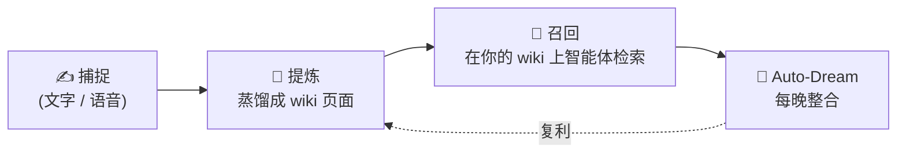

<div align="center">

# 🧠 QCue

**一个「捕捉优先」的第二大脑：把转瞬即逝的想法，变成一座不断生长、互相链接的知识 wiki —— 由 _你自己的_ 大模型密钥驱动。**

[](LICENSE)
[](qcue-rs)
[](qcue_app)
[](#-架构)
[](#-架构)
[](#-qcue-是什么)
[](CONTRIBUTING.md)

[English](README.md) · **简体中文**

</div>

> [!NOTE]
> **BYOK —— 自带密钥（Bring Your Own Key）。** QCue 完全运行在 _你自己的_ 模型提供商密钥之上，
> 从不分发、代理或接触你的凭据；并且整个产品可以**无密钥、离线**地在 stub 模式下运行，
> 让你几秒钟即可上手体验。

QCue 是一个开源的知识、记忆与语义召回系统。把转瞬即逝的想法 —— 无论是打字还是语音 —— 倒进一个
快速的每日信息流；一个自带密钥（BYOK）的大模型会持续把这股信息流提炼成一座持久、互相链接的
**Markdown wiki**（`[[wiki 链接]]`、一份 `index.md`、一份 `log.md`），你可以浏览它、用**召回**
查询它，并在任意 Markdown 编辑器中打开。每晚一次的 **Auto-Dream** 会让这座知识库保持自洽。

---

## 📑 目录

- [✨ QCue 是什么](#-qcue-是什么)
- [🔄 每日循环](#-每日循环)
- [🧱 三个层次](#-三个层次)
- [🏗️ 架构](#-架构)
- [🧰 技术栈](#-技术栈)
- [📂 仓库结构](#-仓库结构)
- [🚀 快速开始（Quickstart）](#-快速开始quickstart)
- [📚 文档](#-文档)
- [🗺️ 路线图](#-路线图)
- [🔐 关于本仓库的提交历史](#-关于本仓库的提交历史)
- [🤝 参与贡献](#-参与贡献)
- [💬 社区交流群](#-社区交流群)
- [🛡️ 安全](#-安全)
- [📄 许可证](#-许可证)
- [™️ 商标](#-商标)

---

<a id="-qcue-是什么"></a>

## ✨ QCue 是什么

|  |  |
| --- | --- |
| 🎙️ **捕捉优先** | 打字或开口说。想法会零摩擦地落入一个仅追加（append-only）的每日信息流 —— 捕捉一个念头的成本应当趋近于零。 |
| 🔗 **LLM-wiki** | 一个 BYOK 模型把你的信息流提炼成 Karpathy 风格的 Markdown wiki：实体页 / 概念页 / 来源页，用 `[[wiki 链接]]` 彼此交织。 |
| 🔎 **智能体召回** | 用自然语言提问。模型会**自己**生成检索式，在全文检索 + 精选记忆之上检索，并基于你的 wiki 作答。 |
| 🌙 **Auto-Dream** | 每晚一次的整合会让 wiki 不断复利、保持整洁 —— 成本在任何一次模型调用**之前**就被核对，所有改动都经由一个可逆的审批闸门提出。 |
| 🔌 **BYOK 且与厂商无关** | 一套 harness，多家厂商。一次会话可以在一个模型上开始，再回退到另一个模型，无需重新编码。密钥始终归你所有。 |
| 📴 **离线优先** | Flutter App 先在本地捕捉、再幂等地回传，所以在飞机上也能用。一个无密钥的 **stub 模式**可在完全无网络下运行整个产品。 |
| 🔒 **天生多租户** | 隔离由数据库**行级安全（RLS）**强制保证，而非应用层过滤。 |
| 🦀 **为长期而建** | 一个 Rust 内核，遵循严格、由 lint 强制的 crate 分层法则；整个技术栈都可在无密钥、无网络的情况下测试。 |

---

<a id="-每日循环"></a>

## 🔄 每日循环



```
捕捉（文字 / 语音）
   └─► 对话提炼：蒸馏成 wiki 页面（实体、概念、来源）
          └─► 召回：你提问，模型自己生成检索式并作答
                 └─► 每晚的 Auto-Dream 整合并让 wiki 不断复利
```

---

<a id="-三个层次"></a>

## 🧱 三个层次

QCue 在「**你**写下的内容」「**大模型**维护的内容」与「治理结构的规则」之间保持清晰的分离：

| 层 | 归属 | 是什么 |
| --- | --- | --- |
| 📥 **原始来源** | **你** | 你仅追加的捕捉信息流 —— 唯一的事实来源，永不被改写。 |
| 📖 **wiki** | **大模型** | 由大模型维护、从你的来源蒸馏而来的 Markdown（兼容 Obsidian）。 |
| ⚙️ **schema** | **你（需审批）** | 每个租户一份、用于治理结构的配置 —— 由人审批。 |

---

<a id="-架构"></a>

## 🏗️ 架构

QCue 由三块真实的代码区域组成，并被组织成一个严格的无环分层栈。

- **🦀 Harness（`qcue-rs/`）。** QCue 与任意大模型厂商之间的承重接缝。单一的回合循环驱动一次对话，
  **从不按厂商名分支** —— 它只通过一个小小的 dispatch trait 触达厂商（测试用脚本化 stub，或真实
  HTTP）。**接入一个新厂商是数据，而非新分支：** 一家厂商就是一份声明式 profile，外加几个无状态
  hook 和若干「线协议怪癖」表项。一切都被规整为一种内部消息形态与一种流事件形态，因此一次会话可以
  在厂商之间回退而无需重新编码。凭据存放在一个带有显式健康状态的池中；错误只被分类一次，随后一个
  重试循环把分类结果映射到 _轮换 / 回退 / 退避 / 中止_ 之一。

- **💡 Idea engine（`qcue-rs/`）。** **双重表示：** 每租户 vault 中的 Markdown 正文是事实来源；
  数据库镜像其结构与 frontmatter 以支持快速查询和 lint。一个单一的**写入闸门**是唯一写 wiki 正文的
  地方 —— 它清洗链接、更新镜像，然后才写文件。**召回是智能体式的。Auto-Dream** 作为后台任务运行，
  成本在任何一次模型调用**之前**就被核对。

- **🌐 后端（`qcue-rs/`）。** 一个多租户 Axum 服务：每张表都启用**行级安全（RLS）**（每个请求绑定
  一个租户上下文）、鉴权、一个加密的 BYOK 密钥保险库、一个任务队列、用于实时回合与召回的 SSE 与
  WebSocket 通道，以及一个 CRDT 同步枢纽。后台 worker 与整合 cron 受 feature 开关控制、默认关闭。

- **📱 App（`qcue_app/`）。** 离线优先的 Flutter（Android + iOS）。**单一数据接缝：** 一个 API
  客户端接口拥有一个 stub 实现（fixture、无密钥）和一个 HTTP 实现；一个「离线感知」装饰器先把写入
  落到本地、再幂等回传，因此屏幕无需感知连通性。设计 token 集中管理，并由架构测试强制约束。

> **Crate 分层法则**（CI 强制）：
> `protocol → http → llm-api → providers → router → {wiki, ideas} → {backend, ffi}`。
> `protocol/` 仅做序列化 —— 任何跨越 Rust↔Dart 边界的东西都属于这里；一个 codegen 步骤导出共享
> schema + Dart 模型，并有一个漂移测试，一旦它们过期就让 CI 失败。

📎 更多细节：[`docs/architecture.md`](docs/architecture.md) · [`docs/design-decisions.md`](docs/design-decisions.md)

---

<a id="-技术栈"></a>

## 🧰 技术栈

| 领域 | 技术 |
| --- | --- |
| 🦀 **内核与后端** | Rust（edition 2024）· Axum · Tokio · SQLx · PostgreSQL 16 · Redis 7 |
| 📱 **App** | Flutter · Dart · Riverpod · Kotlin（Android）· Swift（iOS） |
| 🧠 **大模型** | 与厂商无关的 harness · BYOK · 全文检索（`tsvector` + `pg_trgm`，支持中日韩） |
| 🎨 **设计** | 集中式设计 token · 多主题 · 由架构测试守护 |
| 🧪 **质量** | 全程 TDD · 无密钥/无网络 stub · CI 分层与纯度 lint |

---

<a id="-仓库结构"></a>

## 📂 仓库结构

```
qcue/
├── qcue-rs/             # 🦀 Rust 工作区 —— harness 内核 + idea engine + 多租户后端
│   ├── protocol/        #    仅 serde 的共享类型（Rust↔Dart 边界）
│   ├── http/ llm-api/   #    与厂商无关的传输 + 类型化线协议 + 流解析
│   ├── providers/       #    声明式厂商 profile + hook + 线协议怪癖表
│   ├── router/          #    HARNESS：回合循环、凭据池、重试/轮换/回退、stub
│   ├── wiki/ ideas/     #    IDEA ENGINE：写入闸门 wiki、智能体召回、Auto-Dream
│   ├── app-server/      #    后端：鉴权 + BYOK 保险库 + 任务队列 + SSE/WSS + 同步枢纽
│   └── migrations/      #    SQLx 迁移（多租户/RLS …… 同步）
│
├── qcue_app/            # 📱 Flutter App（Android + iOS）
│   └── lib/
│       ├── core/        #    API 接缝、离线缓存、主题与设计 token、模型
│       └── features/    #    各屏：捕捉 · wiki · 召回 · 动态 · 设置
│
├── design-system/      # 🎨 共享的视觉语言与设计 token
└── docs/               # 📚 精选的公开文档
```

---

<a id="-快速开始quickstart"></a>

## 🚀 快速开始（Quickstart）

> [!TIP]
> 体验 QCue 最快的方式是 **stub 模式** —— 它通过预置 fixture，在**无 API 密钥、无网络**的情况下
> 运行整个产品。

### 📱 App（Flutter）

```sh
cd qcue_app
flutter pub get
flutter test                                      # 单元 + 组件 + 架构测试
flutter analyze
flutter run --dart-define=QCUE_STUB=true          # 离线/演示，预置 fixture，无密钥
```

### 🦀 后端（Rust）

```sh
cd qcue-rs
cargo test --lib                                  # 快速单元测试，无需数据库
cargo clippy --all-targets -- -D warnings
# 完整集成套件（Postgres 16 + Redis 7）与运行服务：见 docs/architecture.md
```

实时后端与厂商密钥的配置见 [`docs/architecture.md`](docs/architecture.md)。

---

<a id="-文档"></a>

## 📚 文档

| 文档 | 内容 |
| --- | --- |
| [`docs/architecture.md`](docs/architecture.md) | 一份公开安全的 QCue 构建概览。 |
| [`docs/design-decisions.md`](docs/design-decisions.md) | 重大设计选择背后的取舍与理由。 |
| [`docs/roadmap.md`](docs/roadmap.md) | QCue 的方向（指引性的，而非承诺）。 |
| [`docs/open-source-publishing.md`](docs/open-source-publishing.md) | 本仓库如何被发布并保持安全。 |
| [`CHANGELOG.md`](CHANGELOG.md) | 值得关注的变更，最新在前。 |

---

<a id="-路线图"></a>

## 🗺️ 路线图

- **现在** —— 一个干净、治理良好的开源项目；一个端到端的 **stub 模式**以便即刻本地体验；更好的
  贡献者上手文档。
- **接下来** —— 一份通用、面向自托管的后端搭建指南（本地 Postgres/Redis 引导，不暴露任何私有基础
  设施）；更广的、有文档的厂商覆盖；更强的公开 CI 故事。
- **更远** —— 更深的召回与整合；更丰富的跨平台 App；社区扩展。

完整细节见 [`docs/roadmap.md`](docs/roadmap.md)。欢迎开 issue 提议或讨论方向。

---

<a id="-关于本仓库的提交历史"></a>

## 🔐 关于本仓库的提交历史

> 本仓库以**干净的公开历史**开始，出于安全、第三方许可证卫生与内部引用保护的考虑。原始的私有开发
> 历史被单独保存。

这是一个深思熟虑的工程决策，**并非**试图掩盖项目的成熟度。Git 历史是一个永久的暴露面 —— 它可能
携带旧密钥、内部运维笔记、部署拓扑、无法被重新授权的第三方材料以及大体积产物。与其重写一段漫长的
私有历史、再寄望于「什么都没漏」，QCue 选择发布一份**精选、经审计的快照**，并从此公开开发。完整
理由以及「包含 / 不包含什么」见 [`DEVELOPMENT_HISTORY.md`](docs/DEVELOPMENT_HISTORY.md)。

---

<a id="-参与贡献"></a>

## 🤝 参与贡献

欢迎贡献！🎉 请先阅读 [`CONTRIBUTING.md`](CONTRIBUTING.md) 与 [`CODE_OF_CONDUCT.md`](CODE_OF_CONDUCT.md)。
对于较大的改动，请先开 issue 讨论再动手。一个很好的起点是用 **stub 模式**（见上）运行 App，端到端
地看清整个产品。

---

<a id="-社区交流群"></a>

## 💬 社区交流群

有反馈、问题，或者想一起共建 QCue？欢迎扫码加入我们的微信用户群 —— 我们非常期待听到你如何使用
QCue，也热忱欢迎广大开发者一起把它做得更好。

<div align="center">
  
  <br/>
  <em>扫码加入「<strong>QCue · 第二大脑</strong>」微信群。</em>
</div>

> [!NOTE]
> 微信群二维码大约每 7 天更新一次。如果上方二维码已过期，请[提交 issue](https://github.com/SparkyWen/qcue/issues)
> 或发邮件至 **helios@sinox.ai**，我们会拉你进群。

---

<a id="-安全"></a>

## 🛡️ 安全

请**私下**报告漏洞 —— 不要为安全问题开公开 issue。见 [`SECURITY.md`](SECURITY.md)。

> [!WARNING]
> **BYOK 提醒：** 切勿提交厂商 API 密钥、令牌、凭据、私钥或生产配置。QCue 在设计上确保密钥永远不会
> 进入日志或数据库 —— 请保持这一点。

---

<a id="-许可证"></a>

## 📄 许可证

QCue 采用 **GNU Affero 通用公共许可证 v3.0（AGPL-3.0）** —— 见 [`LICENSE`](LICENSE)。由于 QCue
可以作为网络服务运行，AGPL-3.0 确保：通过网络提供给用户的修改也必须以源码形式提供。另见
[`NOTICE`](NOTICE) 与 [`THIRD_PARTY_NOTICES.md`](docs/THIRD_PARTY_NOTICES.md)。

---

<a id="-商标"></a>

## ™️ 商标

QCue 的名称、标志与品牌资产均予保留。AGPL-3.0 授权覆盖的是源代码，**而非**品牌使用。见
[`TRADEMARKS.md`](docs/TRADEMARKS.md)。

---

<div align="center">

**以 🦀 Rust · 📱 Flutter · ❤️ 开源 构建。**

[⬆ 回到顶部](#-qcue) · [Switch to English](README.md)

</div>
